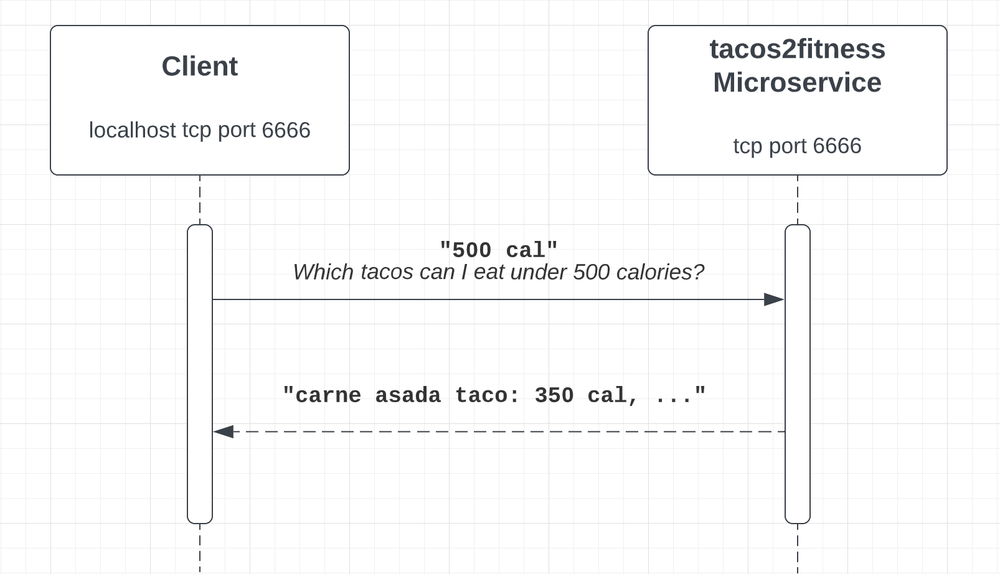
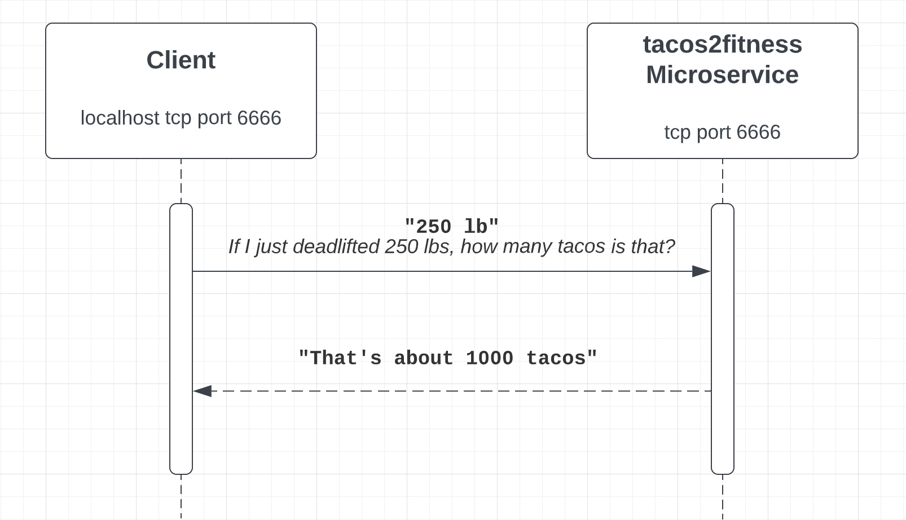

# tacos2fitness

## How to request data from the tacos2fitness microservice
The *tacos2fitness* microservice transfers data via ZeroMQ ([docs](https://zeromq.org/) can be found here).

### 1. Download & Run server locally
Download `tacos2fitness.py` in same directory as your client

Run server by executing `python3 tacos2fitness.py` in terminal

### 2. Setup ZMQ context
`import zmq`

`context = zmq.Context()`

`socket = context.socket(zmq.REQ)`

### 3. Connect to server (socket 6666)
`socket.connect("tcp://localhost:6666")`

### 4. Sending requests via string messages
`socket.send_string(request)` where request is of type `<Str>`

There are currently 2 endpoints in tacos2fitness, outlined further below.

### 5. Receiving responses
`message = socket.recv()` awaits server response

`message = message.decode('UTF-8')` decodes response data into UTF-8

## tacos2fitness Endpoints

1. **Weight to Tacos** endpoint
  1. Request message must be an integer, followed by a space, and the letters "lb"
  1. e.g. "150 lb"
  1. Returns response of number of tacos that weight represents
  1. e.g. "600 tacos"

2. **Calorie Budget Taco Options** endpoint
  - Request message must be an integer, followed by a space, and the letters "cal"
  - e.g. "500 cal"
  - Returns response of tacos served that fit within that calorie budget, as comma separated key-value pairs
  - e.g. "carne asada taco:350,adobada taco:250,al pastor taco:400"
  - The key here would be the type of taco `carne asada taco`, and the value the calories in that taco `350` (calories)

